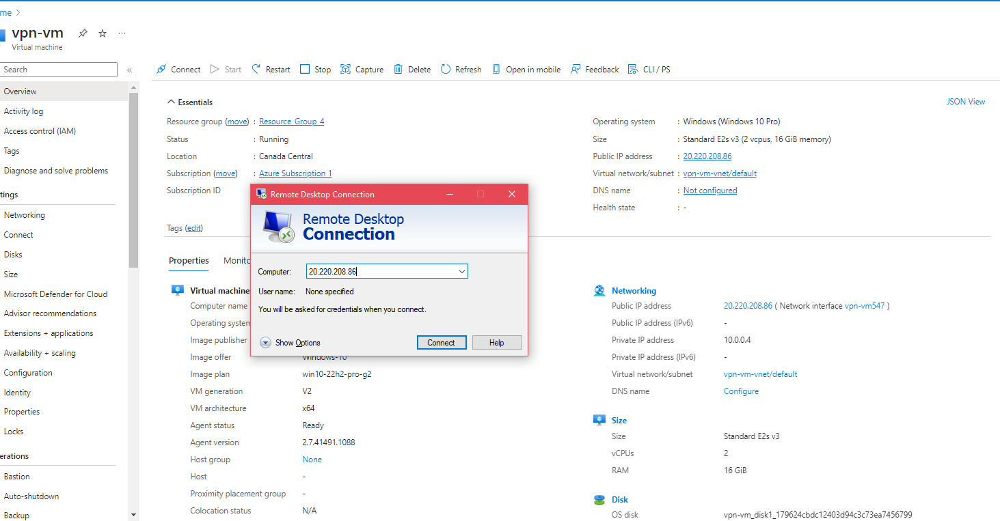

<h1>Virtual Private Network (VPN) Setup and Usage</h1>
In this tutorial, Proton VPN will be used to show how a VPN function to an end-user. Observe the IP addresses from a personal PC to the network inside the VM. 
<h2>What is a VPN? Who can use a VPN ? </h2>  
A VPN allows you to have a secure connection between your computing device and a network. Anyone can use a VPN, however, its mostly seen in large organizations. In a sense, a VPN allows you to be anywhere in the world logically (from the comfort of your home or office). 

- ### [VPN (explained by Microsoft)](https://azure.microsoft.com/en-us/resources/cloud-computing-dictionary/what-is-vpn/#types)

<h2>Environments and Technologies Used</h2>

- Microsoft Azure (Virtual Machines/Compute)
- Remote Desktop
- Proton VPN

<h2>Operating System Used </h2>

- Windows 10 (22H2)

<h2>Steps Taken</h2>

- Observe IP address for physical PC
- Observe IP address within VM (VPN **NOT** connected)
- Observe IP address within VM (VPN connected)

<h2>Actions and Observations</h2>

_⚠️Before we start, if you haven't already, go ahead and create a **Microsoft Azure and Proton VPN** account on your PC._
#

**1️.** Create a VM in Azure running Windows 10 and select a region that is not your current (e.g. if you are in the US select Canada), then, in a new tab find our IP address by going to [What Is My IP Address](https://whatismyipaddress.com/) . Enter a username and password for the Administrator account. These credentials will be used for the Remote Desktop.

  

Open **Remote Desktop** on your PC and use the **Public IP** address from the VM created alongside the username and password from the Administrator account to log in. 

  

**2️.** Once inside open a browser, if you have a preference, say Google Chrome, you can install that too. Go to [ProtonVPN](https://protonvpn.com/) login, download the VPN Client for our operating system, and begin the installation process. 

  

 
  

**3.** In the same browser, go to [What Is My IP Address](https://whatismyipaddress.com/) and observe the new IP address. What is the country/region?  

 
  

**4.** Open the Proton VPN account and lets **connect** the VPN to place us in another location. There's a few options to choose from. Lastly, once connected go to [What Is My IP Address](https://whatismyipaddress.com/) and observe the IP address. Where are you now?  

 
  

Take a few moments to try going to some of your favorite websites, like [Amazon, Netflix, or even Hulu while connected to the VPN.](https://drive.google.com/file/d/1YbZB8vcYDlR_-ZBWzpqnATwbs3AeQqbE/view?usp=drive_link)
#

_If you were following along, you saw that we started in the United States, launched our VM in Canada, then connected the VPN and landed in Tokyo, Japan._

 
